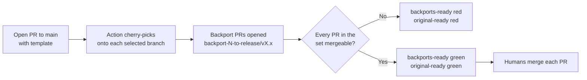

# End-to-end setup

A complete walkthrough for wiring the `backport` action into a repository, from
creating the GitHub App to seeing the bidirectional gate go green.

The example uses a repository with three long-running branches:

- `main` — the default branch, where every change lands first.
- `release/v1.x` and `release/v2.x` — long-running maintenance branches that
  receive backports.

---

## 1. Overview



- The **original PR** on `main` carries the `backports-ready` check.
- **Each backport PR** carries the `original-ready` check.
- No PR in the set can merge until **all** of them are independently mergeable.
- By default the action **never merges** — people do that once everything is
  green. With `auto-merge: true`, backports merge automatically after the
  original is merged (see step 7).

---

## 2. Create the GitHub App

The action authenticates as a GitHub App so the backport PRs it opens trigger
their own CI (a PR opened with the default `GITHUB_TOKEN` would not).

1. Go to **Settings → Developer settings → GitHub Apps → New GitHub App**
   (org-owned is recommended; personal works too).
2. **GitHub App name**: e.g. `acme-backport`.
3. **Homepage URL**: any valid URL (e.g. the repository URL).
4. **Webhook**: uncheck **Active** — this action polls via the API and needs no
   webhook.
5. Set **Repository permissions**:

   | Permission | Access |
   | :--- | :--- |
   | Contents | Read and write |
   | Pull requests | Read and write |
   | Checks | Read and write |
   | Commit statuses | Read |
   | Metadata | Read-only (mandatory) |

6. Leave organization permissions untouched.
7. **Where can this App be installed?** Only on this account.
8. Click **Create GitHub App**.
9. On the App page, note the **App ID**.
10. Under **Private keys**, click **Generate a private key** and download the
    `.pem` file.

---

## 3. Install the App

1. On the App page, open **Install App**.
2. Install it on the account, and choose **Only select repositories** → your
   repository.

The action derives the installation token itself, so you do **not** need to
record the installation ID.

---

## 4. Store the secrets

In the repository, go to **Settings → Secrets and variables → Actions** and add:

| Secret | Value |
| :--- | :--- |
| `APP_ID` | The App ID from step 2 |
| `APP_PRIVATE_KEY` | The full contents of the downloaded `.pem` file |

> When pasting the private key, include the `-----BEGIN...` and `-----END...`
> lines and all newlines.

---

## 5. Add the mandatory pull request template

Create `.github/PULL_REQUEST_TEMPLATE.md`. On open the checked boxes are converted
to `backport:<branch>` labels and this block is removed — after open, manage
backports via those labels. Wrap the block in markers so it strips cleanly.

```md
## Description

<!-- Describe your change. -->

<!-- backport-targets:start -->

## Backport targets

- [ ] release/v1.x
- [ ] release/v2.x

<!-- backport-targets:end -->
```

To make it mandatory, enforce PR-body content with a ruleset (see step 7) or a
required "template filled in" check, so contributors cannot bypass it.

> The template is **optional** — the action is label-driven, and `backport:<branch>`
> labels are the single source of truth. The template only lets targets be chosen
> at **open**, which matters for outside/fork contributors who can edit the PR body
> but can't set labels. If everyone opening PRs can set labels, skip the template
> and add `backport:*` labels directly (at any time) to create backports.

---

## 6. Add the workflow

Create `.github/workflows/backport.yml`. Keep the `branches:` filter and
`backport-branches` list in sync.

```yaml
name: backport

on:
  pull_request:
    types: [opened, synchronize, reopened, closed, labeled, unlabeled]
    branches: # The original PR's base (main) plus your backport branches
      - main
      - release/**
  pull_request_review:
    types: [submitted, dismissed]
  check_suite:
    types: [completed]

permissions:
  contents: read # Only used by actions/checkout; all writes use the App token

# Give each PR its own lane so a burst of opened PRs don't cancel one another
# (a shared group would drop queued runs). A single PR's own events still
# serialize; check_suite/status have no PR number so they fall back to run_id
# and never cancel anything.
concurrency:
  group: backport-${{ github.event.pull_request.number || github.run_id }}
  cancel-in-progress: false

jobs:
  backport:
    runs-on: ubuntu-latest
    steps:
      - name: Checkout
        uses: actions/checkout@v7
        with:
          fetch-depth: 0 # Full history is required to cherry-pick

      - name: Create and gate backport pull requests
        uses: nicklegan/backport@v1
        with:
          app-id: ${{ secrets.APP_ID }}
          private-key: ${{ secrets.APP_PRIVATE_KEY }}
          backport-branches: |
            release/v1.x
            release/v2.x
          # check-name: 'backports-ready'
          # reverse-check-name: 'original-ready'
```

---

## 7. Configure branch protection

The gate only *blocks* merges if the checks are **required**. Use rulesets (or
classic branch protection) on each branch.

### `main`

- Require a pull request before merging.
- **Require status checks to pass** → add `backports-ready`.
- (Recommended) Require the PR body to match the template / require the
  backport checklist to be present.

### `release/v1.x` and `release/v2.x`

- Require a pull request before merging.
- **Require status checks to pass** → add `original-ready`.
- Add whatever CI checks these branches normally require.

### App bypass

The App pushes the backport branches directly. If a **classic branch protection**
rule or a **ruleset** restricts branch creation or pushes on a pattern that
matches the `backport-*` branches, the push will be rejected. Add the App to the
bypass list so it can create and update those branches:

- **Classic protection** — protection on `release/*` normally targets the release
  branches themselves, not the `backport-*` branches, so this is rarely an issue.
- **Rulesets** — rulesets target **branch name patterns** and are often org-wide
  (`**`, `backport-*`). If a ruleset has *Restrict creations/updates/pushes* that
  can match `backport-*`, add the App as a **bypass actor** on that ruleset.

> Required checks must be **pre-registered** by name. `backports-ready` and
> `original-ready` are stable names, so add them once and they apply to every
> future PR — including main-only PRs, which receive an automatically green
> `backports-ready`. This works identically whether the check is required via
> classic protection or a ruleset.

> [!IMPORTANT]
> The gate is **intentionally stricter than your branch protection**. It doesn't
> read your protection/ruleset config, so it treats *every* non-gate check as
> must-pass and *every* review thread as must-resolve — not just the ones you
> mark required. A failing advisory check or a non-blocking unresolved
> conversation can keep the gate red even when GitHub calls the PR mergeable.
> By design the gate can be conservatively red, but never falsely green.
> Set `respect-required-only: true` to gate on required checks only (advisory
> checks are ignored), and `require-conversation-resolution: false` if your
> branches don't require resolved conversations.

### Signed commits

If a target branch requires **signed commits** (classic protection or a ruleset
rule), the cherry-picked commits must be signed or the backport can never become
mergeable — and the gate cannot detect this, so it may look green while the merge
is blocked. Provide a signing key to the action:

- Set `gpg-private-key` (+ `gpg-passphrase`) or `ssh-signing-key`.
- Set `committer-name`/`committer-email` to match the signing key's verified
  identity so GitHub marks the commits **Verified**.
- Register the key on the signing account (Settings → SSH and GPG keys).

### Auto-merge (optional)

With `auto-merge: true`, once the original PR is merged each backport is merged
automatically as soon as its own checks pass — backports never merge before the
original, and conflicted ones wait for a human.

- Enable **Allow auto-merge** in the repository settings.
- Keep `closed` in the `pull_request` trigger types (above) so the action reacts
  when the original is merged.
- Set `auto-merge-method` (`merge`, `squash`, or `rebase`) if you don't want the
  default merge commit.

---

## 8. Walk through a change

1. Open a PR from a feature branch into `main`. In the template, check
   `release/v2.x` only.
2. On open, the action:
   - converts the checked box into a `backport:release/v2.x` label and removes
     the checkbox block from the PR body,
   - cherry-picks your PR's commits onto `release/v2.x`,
   - pushes `backport-<pr>-to-release/v2.x`,
   - opens a backport PR titled `[Backport release/v2.x] <your title>` with body
     ``Backport of #<pr> to `release/v2.x`.`` (plus a conflict warning if the
     cherry-pick hit conflicts),
   - posts `backports-ready` (red/pending) on your PR and `original-ready`
     (red/pending) on the backport PR.
3. Manage targets afterwards with labels: add `backport:release/v1.x` to open
   another backport, or remove a label to close one (its branch is kept).
4. As CI runs and reviews land on **both** PRs, the action re-evaluates on each
   `check_suite` completion and review event.
5. When both PRs are independently mergeable (no conflicts, CI green, approvals
   satisfied), both checks turn green.
6. A human merges each PR — or, with `auto-merge: true`, each backport merges
   automatically once the original is merged and its checks pass. The action
   never deletes branches.

---

## 9. Troubleshooting

| Symptom | Likely cause |
| :--- | :--- |
| No backport PR opened | Branch checked in the template is not in `backport-branches`, or the box was left unchecked. |
| Backport PR check stays red | Cherry-pick conflict (resolve it), failing CI, or missing approval on that PR. |
| `backports-ready` never appears on main | Workflow `branches:` filter excludes the base, or the check name isn't added to branch protection. |
| Backport branch push rejected | The App isn't in the ruleset bypass list for `release/*`. |
| Backport PR CI didn't run | The App lacks a permission, or the PR was somehow opened with `GITHUB_TOKEN` instead of the App token. |
| Gate stuck pending | A required check on a PR is still running; the gate resolves once it completes. |
